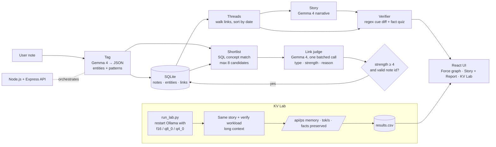

# newNectore: Build Guide

**Team WInDaChat · Hacktoberfest Hack Day Coimbatore 2026 (INIT CLUB × iDEA CLUB × MLH)**

Put this file in the repo as `docs/BUILD_GUIDE.md` so every teammate and Claude Code can read it. It holds everything from our planning chat: the idea, the research, the decisions, the gotchas, and a step-by-step build with **stopping points** where you run the app and check it before moving on.

---

## How to use this guide

- Work through the steps **in order**. Each step has:
  - ⏱ a time budget
  - 💬 a prompt to paste into Claude Code
  - ✅ a **CHECKPOINT**: what to run and what you should see
  - 🧯 what to do if it's broken
- **Don't start the next step until the checkpoint passes.** Then commit.
- If a step blows past its time budget by more than 15 minutes, look at the cut list in [Section 9](#9-cut-list-when-time-runs-out).
- **Claude Code** does the building, inside the repo. **Cowork** (claude.ai) is for research, README/Devpost writing, the pitch and seed content, so Claude Code doesn't lose focus.

---

## 1. The idea in one paragraph

**newNectore** is a local-first second brain. You write short notes (lecture notes, textbook concepts, news snippets). Gemma 4 runs locally through Ollama and does four things:

1. **Connect.** It tags each note and links it to related older notes, across subjects, with a typed relation and a one-line reason. The notes show up as an **Obsidian-style live graph**.
2. **Story.** It narrates any thread of linked notes as a short story.
3. **Verify.** It checks its own story against your notes for dropped facts (numbers, "not", "unless", deadlines) and shows a per-fact faithfulness report.
4. **Compress (KV Lab).** It runs the same story + verify workload with Gemma's KV cache at `f16` / `q8_0` / `q4_0` and measures memory, speed and how many facts survive.

**Pitch line:** *"Your notes, connected by Gemma 4, with receipts. And we measured how far you can squeeze Gemma's memory before it starts forgetting your facts."*

**The headline example:**
- Monday: a note on *negative feedback* (Control Systems).
- Thursday: a note on *TCP congestion control* (Computer Networks).
- Saturday: a news snippet about *RBI raising the repo rate to curb inflation*.

newNectore links all three as the same mechanism, a **feedback loop**, and tells them as one story.

---

## 2. Hackathon constraints (from the repo's AGENTS.md / README template)

- ~4–5 hours of build time, mostly vibe-coded with Claude Code.
- The project must:
  - be relevant to current times
  - be an app with a showable UI
  - use an **open-weight model with a real use**. We use **Gemma 4**, installed locally through Ollama.
- `README.md` is the **primary submission document**. It must follow the template sections:
  - Title & Pitch
  - Team
  - Problem
  - Why we chose it
  - Solution & Key Features
  - Innovation
  - Technical Implementation (architecture Mermaid, stack table, how it works, decisions)
  - Implementation During the Hackathon
  - Team Contributions
  - Working App
  - Demo Video
  - Open Source & AI Usage
  - Setup & Usage
  - Devpost
  - Challenges & Learnings
  - Credits & License
  - Submission checklist
- **Don't** put judging criteria or organiser-only information in the README.
- **No fabricated metrics, results, features or history.** Only claim what we built and measured. This matters a lot for the KV Lab numbers.
- Document every AI model, library and dataset, with what it does and its license. Don't hide dependencies or claim external work as ours.
- **Never commit secrets.** Use `.env`, keep it untracked, and provide `.env.example`.
- Code quality: keep it simple, keep modules focused, validate external input (including model output), keep config separate, and remove debug code before submitting.
- Before saying a feature is done: run it, check that the app starts, test manually, and update the README.

---

## 3. Where this came from: the three original ideas

We combined three ideas from the project docs.

### Idea 1: newNectore (the base idea)
A personal learning app that turns scattered notes into connected knowledge. There are no folders, tags or manual linking; you just write. Every note goes through a four-stage pipeline:

1. **Tagging:** Gemma 4 returns JSON with a one-line summary plus key concepts and entities, normalised (e.g. "Reserve Bank of India" becomes "RBI").
2. **Shortlisting:** a plain SQL query finds older notes that share at least one concept, about 15 at most. No AI here, so it's fast and free.
3. **Linking:** one Gemma 4 call judges the new note against the shortlist. For each candidate it returns:
   - a relation type: `causes`, `consequence_of`, `continuation`, `contradicts` or `same_idea`
   - a strength from 1 to 5
   - a reason that must cite a specific shared fact
4. **Filtering:** only links with a valid type, strength ≥ 4, and a target that was in the shortlist are saved. Zero links is a valid answer.

Threads are never stored. They're computed by walking links and sorting by date. Story view sends one thread to Gemma 4, and only when you tap the button.

Why LLM reasoning instead of embeddings: cosine similarity sees shared *words*. The control-systems note and the RBI note share almost none, but Gemma can reason that they describe the same mechanism, and it gives a human-readable reason.

UX principles:
- one input box
- instant feedback (tags and links appear right away)
- strict linking, so there are no weak "both are about tech" links
- stories over graphs for reading (we now have **both**: the graph for exploring, the story for reading)

Planned future work: import from URL/PDF, weekly digests, quizzes generated from threads, on-device Gemma on Android.

### Idea 2: TrueSimple (the verification layer)
Simplify dense text, then check that the rewrite didn't drop or change important facts:

- (a) Gemma extracts **must-keep facts** (dates, numbers, names, negations, conditions, exceptions, obligations) as JSON with source spans.
- (b) For each fact, Gemma writes a question, then answers it using **only** the rewrite. "Not stated" is allowed.
- (c) Deterministic regex checks on numbers, dates, units and cue words.
- (d) An optional NLI model.

Each fact gets a status: **Appears preserved / Needs review / Possible mismatch**, shown with its source span. Never claim "verified" or "safe".

Example: *"You may cancel within 30 days unless you've used the service for more than 10 hours. Refunds within 5 business days."* The check should flag a rewrite that drops the "unless" exception.

**In our combined app, the verifier checks Gemma's *story* against the *source notes*.**

### Idea 3: Gemma 4 KV-cache quantization (the "context reducer")
The original plan:
- capture the real KV cache through Hugging Face Transformers
- fake-quantize K and V to INT8/INT4 and compare FP16, INT8/INT8, INT4/INT4, K8/V4 and K4/V8
- measure MSE, cosine, attention KL, output KL, top-1 agreement and accuracy
- build a layer sensitivity heatmap and a mixed-precision allocation, shown in a Streamlit dashboard

The key line: *"Find where INT4 is safe, where INT8 is needed, and where FP16 must stay."*

**What we kept:** the core question (how much KV compression before quality drops), using real quantization through Ollama and **fact preservation as the quality metric**.

---

## 4. Research findings (3 research subagents, Oct 2026)

Treat the numbers below as other people's reports, not ours. Measure on our own machine.

### 4.1 Gemma 4 on Ollama
- **Tags** on `ollama.com/library/gemma4`:

  | Tag | Size | Context |
  |---|---|---|
  | `gemma4:e2b` | ~2.3B effective | 128K |
  | `gemma4:e4b` | ~4.5B effective, also `:latest` | 128K |
  | `gemma4:12b` | | 256K |
  | `gemma4:26b` | MoE, ~3.8B active | 256K |
  | `gemma4:31b` | | 256K |

  There are also `-mlx` variants for Mac. **Run `ollama list` to see exactly what we have.** Our default is **`gemma4:e4b`**.
- **Context trap:** Ollama's default context depends on VRAM and is **4K below 24 GiB**, so on a laptop long prompts get silently cut. **Always pass `num_ctx`** (e.g. 16384) in every request.
- **Structured JSON:** pass a JSON schema as `format`, use temperature 0, and validate the reply. Known issues:
  - [ollama#15260](https://github.com/ollama/ollama/issues/15260) / [#14645](https://github.com/ollama/ollama/issues/14645): with `think:false` the schema was ignored in older versions. Reported fixed in later releases.
  - [ollama#18774](https://github.com/ollama/ollama/issues/18774) (open, gemma4:e4b): with `think:true` the output can break the schema while still returning HTTP 200. **Use `think:false`.**
  - [ollama#15502](https://github.com/ollama/ollama/issues/15502): 26b/31b can loop and repeat inside long string fields. **Keep string fields short, set a `num_predict` cap, and also describe the schema in the prompt.**
  - [ollama#17183](https://github.com/ollama/ollama/issues/17183) / [#16776](https://github.com/ollama/ollama/issues/16776): **MLX builds ignore `format`**. Use the normal GGUF tags.
  - **Rule:** always validate with Zod and retry once. On a second failure, show an error and never save bad data.
- **Speed** (others' numbers):

  | Hardware | Model | Speed |
  |---|---|---|
  | RTX 4090 | E4B | ~92 tok/s |
  | M2 Pro | E4B | ~30–40 tok/s |
  | CPU only | E4B | ~3–5 tok/s |
  | CPU only | E2B | ~8–12 tok/s |

  Expect roughly 25–50 tok/s on a laptop GPU if the model fits in VRAM. **Measure ours in Step 0.**

### 4.2 newNectore research
- **Prior art:**
  - Obsidian Smart Connections chunks notes, embeds them (e.g. `nomic-embed-text`) and shows similar notes, but gives no relation type and no reason.
  - Mem and Reflect also show "related notes" by similarity, in the cloud.
  - **Our difference:** typed links, a cited reason for each, threads, narrated stories, and everything local.
- **The "reasoning, not embeddings" claim is partly defensible.** A 2026 paper ([arXiv 2604.05396](https://arxiv.org/html/2604.05396v1)) found similarity retrievers miss examples that share reasoning structure but not wording. It didn't directly test against an LLM judge, though, so don't overclaim.
- **The weak spot in the original plan:** a SQL shortlist on shared concepts *also* needs shared words. **Fix:** the tagging prompt also outputs **`patterns`**, abstract mechanisms like "feedback loop", "trade-off", "bottleneck" or "equilibrium". The shortlist matches on entities OR patterns.
- **Optional hybrid (stretch):** `embeddinggemma` (300M, ~622 MB on Ollama) gives a cheap top-k, merged with the SQL matches, and then Gemma judges. Pitch: "embeddings find candidates, Gemma decides and explains."
- **Latency:**
  - The naive design (1 tag call + up to 15 link calls) takes a minute or more per note.
  - **Fix:** judge all candidates in **one batched call**, so it's 2 calls per note.
  - Cap candidates at **8** and keep reasons under 25 words.
  - Use `keep_alive` so the model stays loaded.
  - Stream the story.
  - Pre-compute the seed notes' links before the demo.

### 4.3 TrueSimple research
- **Prior art:**
  - QAGS / QuestEval: generate questions from the source and answer them from the summary. Our fact quiz is QAGS-style, with Gemma playing both roles. Cite QAGS as the inspiration.
  - SummaC / FactCC: run NLI over sentence pairs.
  - AlignScore: RoBERTa, ~355M parameters.
  - MiniCheck: reported as on par with GPT-4 on LLM-AggreFact at far lower cost, but it has no pip package and assumes CUDA, so the install could take 30+ minutes.
- **Decision: skip NLI.** If there's spare time, `cross-encoder/nli-deberta-v3-small` would be the easiest add. It's a Python model, so it's a stretch goal only.
- **Why it's relevant now:**
  - [Peters & Chin-Yee, Royal Society Open Science, 2025](https://pmc.ncbi.nlm.nih.gov/articles/PMC12042776): across 4,900 summaries from 10 LLMs, LLM summaries were about 5× more likely to overgeneralise than human ones. Asking them to "be accurate" made it worse.
  - [EBU/BBC study, Oct 2025](https://aib.org.uk/ai-assistants-misrepresent-news-content-says-major-study/): 45% of AI-assistant news answers had at least one significant issue.
- **Value per minute of build:**
  1. Regex cue diff (~20 min, very visual)
  2. Fact extraction + answer from the output only (~45 min)
  3. Side-by-side report UI (~25 min)
  4. **Demo trick:** ship a hand-written "sabotaged" story that drops an "unless" clause, so the flag fires reliably on stage.

### 4.4 KV-cache research
- **The practical shortcut:** Ollama's `OLLAMA_KV_CACHE_TYPE` accepts `f16` (default), `q8_0` (~½ the memory) or `q4_0` (~¼) ([Ollama FAQ](https://docs.ollama.com/faq)).
  - It needs flash attention. Set **`OLLAMA_FLASH_ATTENTION=1`**.
  - It is **server-wide**, so you restart `ollama serve` for each setting.
  - **K and V can't be set separately in Ollama.**
  - llama.cpp's `llama-server` *can* set them separately with `-ctk/--cache-type-k` and `-ctv/--cache-type-v`. That's how a K8/V4 vs K4/V8 test would work, and it's a **stretch / future** item.
- **Gemma 4 is unusually sensitive.** [LocalBench](https://localbench.substack.com/p/kv-cache-quantization-benchmark) reported:

  | Model | Cache | KL divergence | Top-1 agreement |
  |---|---|---|---|
  | 31B | q8_0 | 0.108 | |
  | 26B-A4B | q8_0 | 0.377 | |
  | 26B-A4B | q4_0 | 1.088 | ~68% |

  Qwen models stayed under 0.04. So the common advice "q8_0 is lossless" may be wrong for Gemma. **That's why our lab is interesting.**
- **Gotchas:**
  - [llama.cpp#24485](https://github.com/ggml-org/llama.cpp/issues/24485): on CUDA, a quantized KV cache with Gemma 4's head_dim 512 can **silently fall back to CPU**, making it 25–45× slower. Speed numbers could be misleading, so check GPU use.
  - Unconfirmed whether Ollama's engine applies the cache type to Gemma 4 or silently falls back to f16. **Check that the memory number actually changes** before trusting results.
- **Measuring:**
  - Use `GET /api/ps`, which returns `size`, `size_vram` and `context_length`. Note that `size_vram` is Ollama's estimate.
  - For ground truth on NVIDIA, use `nvidia-smi --query-gpu=memory.used --format=csv`.
  - For speed, use `eval_count / eval_duration` from the response.
- **Gemma 4 architecture** (from the HF configs):

  | | E2B | E4B |
  |---|---|---|
  | Layers | 35 (28 sliding / 7 full) | 42 (35 sliding / 7 full) |
  | KV heads | 1 | 2 |
  | Head dim (sliding / global) | 256 / 512 | 256 / 512 |
  | Sliding window | 512 tokens | 512 tokens |
  | KV sharing | last 20 layers reuse earlier KV | last 18 layers reuse earlier KV |

  The research agent's **rough estimate** (not measured) for E4B f16 KV was ~0.5 GB at 32K tokens and ~2 GB at 128K. **At the default 4K context the difference is invisible.** The lab needs `num_ctx` of **32K** and a prompt of about 20–30K tokens.
- **Prior work for an honest hypothesis:**
  - **KIVI** (arXiv:2402.02750): quantize keys per-channel and values per-token.
  - **KVQuant** (arXiv:2401.18079): quantize keys per-channel and before RoPE, with outlier handling.
  - **Hypothesis:** keys have outlier channels, so K is more sensitive than V. We expect q8_0 to keep most facts and q4_0 to drop some at long context. **Report it as a hypothesis, with raw counts and no claims of significance.**
- **Route decision:**
  - The HF fake-quant route is **too risky** for 4 hours on a laptop. E2B in bf16 is ~10 GB, and KV sharing makes cache capture awkward.
  - **Use the Ollama route.**
  - **Drop** the layer heatmap and mixed-precision allocation; they can't be built honestly in the time.

---

## 5. Final design decisions

| Decision | Choice | Why |
|---|---|---|
| Stack | **Node.js + Express** backend, **React + Vite + Tailwind** frontend | We want a proper app with rich visuals, not Streamlit |
| Graph | **`react-force-graph-2d`** | Obsidian-style force-directed graph with glowing nodes, drag and zoom in ~50 lines |
| Model client | official **`ollama`** npm package | Supports `format` (JSON schema), streaming, `keep_alive`, `options.num_ctx` |
| Validation | **Zod** (`z.toJSONSchema` in Zod 4, or `zod-to-json-schema`) | Takes Pydantic's role. The schema is sent to Ollama and used to validate the reply |
| DB | **SQLite** via `better-sqlite3` | Zero setup, one file. Replaces Neon/Postgres from the base idea |
| Default model | `gemma4:e4b`, set through `.env` | Fits a laptop |
| Calls per note | **2** (tag, then one batched link call) | Keeps saving a note fast |
| Link filter | strength ≥ 4, valid type, target in shortlist | Clean graph, and the model can't invent links |
| Verifier | regex cue diff + fact quiz, **no NLI** | Most demo value per minute |
| KV Lab | Node script that restarts Ollama with f16 / q8_0 / q4_0; results go to JSON; a simple page charts them | Real quantization, honest numbers |
| Graph extras | links coloured by relation type, hover shows the reason, new nodes animate in, **drag one node onto another to ask Gemma "are these connected?"**, clicking a node opens its thread | The "connect the nodes" feature, with real model reasoning |
| License | MIT (Gemma weights: Apache 2.0) | |
| Tools | **Claude Code** builds in the repo; **Cowork** handles research, README, Devpost, pitch and seed notes | |

### Repo layout (target)

```text
.
├── README.md
├── AGENTS.md / CLAUDE.md          (already in repo — hackathon rules)
├── LICENSE
├── .env.example
├── .gitignore                     (node_modules, .env, *.db, server/lab/results/*.tmp)
├── package.json                   (npm workspaces: server, client; scripts: dev, seed, lab)
├── docs/BUILD_GUIDE.md            (this file)
├── server/
│   ├── package.json
│   ├── src/
│   │   ├── index.js               (Express app, routes)
│   │   ├── config.js              (reads .env)
│   │   ├── db.js                  (better-sqlite3, schema, queries)
│   │   ├── llm.js                 (ollama client, callJson(schema, prompt) with Zod validate + 1 retry)
│   │   ├── prompts.js             (ALL prompts in one file)
│   │   ├── schemas.js             (Zod schemas)
│   │   ├── pipeline.js            (tag → shortlist → link → filter)
│   │   ├── threads.js             (walk links → ordered thread)
│   │   ├── story.js               (streamed narrative)
│   │   └── verify/
│   │       ├── cues.js            (regex cue diff)
│   │       └── quiz.js            (fact extraction + answer-from-output-only)
│   ├── scripts/seed.js
│   ├── data/seed_notes.json
│   └── lab/
│       ├── runLab.js
│       └── results/results.json
└── client/
    ├── package.json
    ├── index.html
    └── src/
        ├── main.jsx, App.jsx
        ├── api.js
        └── components/
            ├── NoteInput.jsx
            ├── GraphView.jsx
            ├── SidePanel.jsx      (note details, thread, story, faithfulness report)
            ├── FaithReport.jsx
            └── LabPage.jsx
```

### Data model

```sql
notes(id INTEGER PK, text TEXT, summary TEXT, created_at TEXT)
terms(id INTEGER PK, name TEXT UNIQUE, kind TEXT CHECK(kind IN ('entity','pattern')))
note_terms(note_id, term_id, PRIMARY KEY(note_id, term_id))
links(id INTEGER PK, src INTEGER, dst INTEGER, type TEXT, strength INTEGER,
      reason TEXT, origin TEXT CHECK(origin IN ('auto','manual')), created_at TEXT,
      UNIQUE(src, dst))
```

### API

| Method | Path | Does |
|---|---|---|
| GET | `/api/health` | `{ ok, model, ollama: up/down, ollamaVersion }` |
| GET | `/api/notes` | all notes with terms |
| POST | `/api/notes` | `{text}` → runs the pipeline → `{note, terms, links}` |
| GET | `/api/graph` | `{nodes:[{id, label, summary}], links:[{source, target, type, strength, reason}]}` |
| GET | `/api/thread/:id` | ordered notes in that note's thread |
| POST | `/api/story` | `{noteIds}` → **streams** the story (SSE or chunked text) |
| POST | `/api/verify` | `{noteIds, text}` → `{cues:[...], facts:[{fact, span, question, answer, status}]}` |
| POST | `/api/connect` | `{a, b}` → Gemma judges the pair → saves the link if strength ≥ 4 → `{linked, type, strength, reason}` |
| GET | `/api/lab/results` | contents of `results.json` |

### Gemma 4 call settings (use everywhere)

```js
{ model: process.env.OLLAMA_MODEL, think: false, keep_alive: "30m",
  options: { temperature: 0, num_ctx: Number(process.env.NUM_CTX), num_predict: 800, seed: 42 },
  format: jsonSchema /* only for JSON calls */ }
```

---

## 6. Team workflow (shared repo)

- Clone: `git clone https://github.com/chuckstone-cpu/hacktoberfest-hack-day-coimbatore-x-init-club-and-idea-club--Team_WInDaChat.git`
- `main` should always run. Work on short branches, one per step (e.g. `step-4-tagging`), and merge after the checkpoint passes.
- **Commit after every passing checkpoint**, with messages like `step 4: gemma tagging with zod validation`. These commits are also our honest "built during the hackathon" history.
- `.env` and `*.db` are never committed.
- Suggested split once Step 2 is merged:

  | Person | Owns |
  |---|---|
  | A | Server pipeline (Steps 3–5, 7) |
  | B | Graph UI and side panel (Steps 6, 10) |
  | C | Verifier, KV Lab, README/Devpost (Steps 8, 9, 11) |

- Keep a running log in `docs/HACKLOG.md`: what was built, by whom and when. It feeds the README sections "Implementation During the Hackathon", "Team Contributions" and "Challenges".

---

## 7. Step-by-step build

> Paste each 💬 prompt into Claude Code from the repo root. Claude Code reads `AGENTS.md`/`CLAUDE.md` automatically. The prompts also point it at this guide.

### STEP 0: Pre-flight (do this before the clock starts if you can) ⏱ 15 min

Run these on the laptop that will host Ollama:

```bash
ollama --version                 # note it; goes in README. Update Ollama if old.
ollama list                      # confirm gemma4:e4b (or which tag you have)
ollama pull gemma4:e4b           # if missing
```

JSON smoke test (run it 3–5 times):

```bash
curl -s http://localhost:11434/api/chat -d '{
  "model": "gemma4:e4b", "stream": false, "think": false,
  "options": {"temperature": 0, "num_ctx": 8192},
  "format": {"type":"object","properties":{"summary":{"type":"string"},"patterns":{"type":"array","items":{"type":"string"}}},"required":["summary","patterns"]},
  "messages": [{"role":"user","content":"Tag this note as JSON with a one-line summary and abstract patterns: TCP halves its window when packets drop and grows it slowly otherwise."}]
}'
```

✅ **CHECKPOINT 0**
- The reply's `message.content` parses as JSON with `summary` and `patterns`, on every run.
- Note the `eval_count` and `eval_duration` from the response. tok/s = `eval_count / eval_duration * 1e9`. Write it down; it tells us how snappy the demo will be.
- `curl -s http://localhost:11434/api/ps` lists the model.

🧯 **If broken**
- JSON is ignored or malformed: update Ollama and make sure you're not on an `-mlx` tag.
- Too slow (under ~10 tok/s): switch to `gemma4:e2b`.

---

### STEP 1: Commit the docs ⏱ 10 min

Add to the repo:
- `README.md` (the draft we wrote; it replaces the template)
- `docs/BUILD_GUIDE.md` (this file)
- `LICENSE` (MIT)
- `.env.example`
- `.gitignore`

`.env.example`:

```env
OLLAMA_HOST=http://localhost:11434
OLLAMA_MODEL=gemma4:e4b
NUM_CTX=16384
DB_PATH=nectore.db
PORT=3001
```

✅ **CHECKPOINT 1:** `git status` is clean after the commit, and `.env` is not tracked. Push to main.

---

### STEP 2: Scaffold and run a skeleton app ⏱ 30 min

💬 **Prompt:**
> Read AGENTS.md, README.md and docs/BUILD_GUIDE.md (sections 5 and 7). Scaffold the monorepo exactly as in the "Repo layout" in section 5, using npm workspaces `server` and `client`.
>
> **Server:**
> - Node 20, ES modules, Express, `ollama`, `better-sqlite3`, `zod`, `dotenv`, `cors`.
> - Implement only `config.js`, `index.js` and `llm.js`.
> - `GET /api/health` returns `{ok, model, ollama: "up"|"down", ollamaVersion}` by calling Ollama's `/api/version`.
>
> **Client:**
> - Vite + React + Tailwind with a dark, Obsidian-like theme (near-black background, purple accent).
> - A header "newNectore" and a status pill that shows the model name and whether Ollama is up, from `/api/health`.
> - A placeholder area for the graph.
>
> **Root scripts:**
> - `npm run dev` runs both with `concurrently`: server on PORT, client on 5173 with a proxy to `/api`.
>
> Don't build any features yet. Run it and confirm it starts.

✅ **CHECKPOINT 2**
- `npm install && npm run dev` works.
- `http://localhost:3001/api/health` shows `ollama: "up"`.
- `http://localhost:5173` shows the dark UI with a **green** status pill.
- Stop Ollama, refresh, and the pill turns **red** without the app crashing.

🧯 **If broken:** `better-sqlite3` build errors on Windows usually need the Node LTS that matches its prebuilt binaries. Ask Claude Code to fix it, or fall back to `sql.js`/`node:sqlite`.

**Commit:** `step 2: skeleton app`

---

### STEP 3: Notes CRUD (no AI yet) ⏱ 20 min

💬 **Prompt:**
> Implement `db.js` with the schema in docs/BUILD_GUIDE.md section 5, created on startup.
>
> **Routes:**
> - `GET /api/notes`
> - `POST /api/notes`, which for now just saves the text with an empty summary
> - `GET /api/graph` in the documented shape (nodes from notes; links from the links table)
>
> **Client:**
> - `NoteInput.jsx`: one input box fixed at the bottom with Enter to save.
> - A simple list of notes, temporarily in place of the graph.
>
> Validate input: text must be non-empty and at most 2000 characters.

✅ **CHECKPOINT 3**
- Add 3 notes in the UI, refresh, and they're still there.
- An empty note is rejected with a friendly message.
- `/api/graph` returns 3 nodes and 0 links.

**Commit:** `step 3: notes crud`

---

### STEP 4: Gemma tagging with validated JSON ⏱ 30 min

💬 **Prompt:**
> Implement the following:
>
> - **`schemas.js` (Zod):**
>   - `TagResult = {summary: string (≤ 25 words), entities: string[] (≤ 8, normalised canonical names, e.g. "RBI" for "Reserve Bank of India"), patterns: string[] (1–4 abstract mechanisms like "feedback loop", "trade-off", "bottleneck", "equilibrium", "exponential growth"; lowercase)}`.
> - **`prompts.js`:** a tagging prompt that also describes the schema in plain text.
> - **`llm.js`:**
>   - `callJson(schema, messages)`, which converts the Zod schema to JSON Schema, calls Ollama with the settings in section 5 (`think:false`, `temperature 0`, `num_ctx` from env, `num_predict` cap, `keep_alive`), parses and validates the reply, retries once on failure, and then throws a clear error.
>   - Log the duration of each call.
> - **`pipeline.js`:** `tagNote(note)` upserts terms (lowercase-trimmed, kind entity/pattern) and fills `note_terms` and `summary`.
> - **`POST /api/notes`:** saves the note, runs tagging, and returns `{note, terms}`. If Gemma fails, keep the note but return a `tagError` field, and don't save partial terms.
> - **Client:** after saving, show a small toast with the summary and the pattern/entity chips.

✅ **CHECKPOINT 4**
- Add: *"Negative feedback in control systems compares output to the setpoint and corrects the error, which keeps the system stable."*
  - You see a summary, and the patterns include something like "feedback loop".
- Add the TCP note and the RBI note from section 8. The pattern chips should overlap ("feedback loop").
- The server log shows the time per call. **Tagging should take a few seconds, not 30.**
- Kill Ollama, add a note, and the note is saved with a visible "tagging failed" state. Nothing crashes.

🧯 **If broken**
- Patterns are inconsistent ("feedback" vs "feedback loop"): add a short list of preferred pattern names to the prompt and ask it to reuse them when they fit.
- JSON fails a lot: check the Ollama version and `think:false`.

**Commit:** `step 4: gemma tagging`

---

### STEP 5: Shortlist, batched linking and filtering ⏱ 35 min

💬 **Prompt:**
> Implement the rest of the note pipeline in `pipeline.js`:
>
> 1. **`shortlist(noteId)`:** SQL for older notes sharing at least one term (entities or patterns), ranked by number of shared terms, max 8.
> 2. **`linkNote(noteId, candidates)`:** ONE Gemma call with the new note and all candidates (id, summary, text truncated to ~400 chars).
>    - Zod schema: `{links: [{note_id: int, type: enum[causes, consequence_of, continuation, contradicts, same_idea], strength: int 1-5, reason: string ≤ 25 words citing a specific shared fact}]}`.
>    - Tell the model that an empty list is a correct answer and that weak "both are about X" links must get strength ≤ 2.
> 3. **Filter:** keep only `strength >= 4`, a valid type, and a `note_id` that was in the candidate list. Save to `links` with `origin='auto'` (src = new note, dst = old note). Ignore duplicates.
> 4. **`POST /api/notes`:** returns `{note, terms, links}`.
>
> Also:
> - Create `server/data/seed_notes.json` from docs/BUILD_GUIDE.md section 8.
> - Add `server/scripts/seed.js` (`npm run seed`), which resets the DB and inserts the seed notes **through the same pipeline**, one by one in order, printing the links found.
> - **Client toast:** show "Linked to N notes", each with its type and reason.

✅ **CHECKPOINT 5**
- `npm run seed` finishes, and the log shows links being created.
- The headline trio (control-systems feedback ↔ TCP ↔ RBI repo rate) is linked with `same_idea` and a reason that mentions feedback.
- The **photosynthesis** control note gets **0 links**. That's correct; it shows the filter works.
- No link points to a note that isn't in the DB.
- Adding one note takes 2 Gemma calls (check the log), and it feels acceptable for a demo.

🧯 **If broken**
- Too few links: loosen the shortlist (match patterns only) or lower the threshold to ≥ 3 *temporarily* to debug. Go back to 4 for the demo.
- Too many weak links: make the prompt stricter.
- **Write the final behaviour down in HACKLOG.**

**Commit:** `step 5: linking pipeline + seed`

---

### STEP 6: The Obsidian-style graph ⏱ 40 min

💬 **Prompt:**
> Replace the notes list with `GraphView.jsx` using `react-force-graph-2d`, fed by `/api/graph`.
>
> **Look:** Obsidian-style dark canvas.
> - Nodes are small glowing circles (radius grows with link count), with labels showing a short version of the summary that appear when zoomed in or on hover.
> - Links are coloured by relation type, with a legend: `same_idea` purple, `causes` orange, `consequence_of` amber, `continuation` blue, `contradicts` red.
> - Link width follows strength.
> - Hovering a link shows a tooltip with type + reason. Hovering a node highlights its neighbours and dims everything else.
> - Gentle d3 forces, and a zoom-to-fit on load.
>
> **Live updates:** when a note is added, append the new node and its links to the graph data without re-creating the graph. The new node should pulse or glow for ~2 seconds and its links should appear.
>
> **Click a node:** open `SidePanel.jsx` on the right with the full text, the term chips and its links (with reasons). Leave a placeholder button "Tell the story".
>
> Keep it smooth with ~50 nodes.

✅ **CHECKPOINT 6**
- After `npm run seed`, the graph shows the clusters. The feedback-loop cluster is visibly connected, and photosynthesis floats alone.
- Hovering a link shows its reason.
- Add a new note live (e.g. the gradient-descent note) and watch it pop in and connect.
- Clicking a node opens the side panel.
- **This is the "wow" moment. Record a short screen clip now as a backup for the demo video.**

**Commit:** `step 6: force graph`

---

### STEP 7: Threads and streamed story ⏱ 30 min

💬 **Prompt:**
> Implement the following:
>
> - **`threads.js`:** `getThread(noteId)` does a BFS over links in both directions up to depth 3 and at most 8 notes, sorted by `created_at`. Add `GET /api/thread/:id`.
> - **`story.js` and `POST /api/story` `{noteIds}`:** stream a short narrative (≤ 200 words) from Gemma (plain text, no JSON) that ties the notes together in order, explains the shared mechanism, and **does not add facts that aren't in the notes**.
>   - Pass the full note texts.
>   - Use `num_ctx` from env.
>   - Stream to the client with chunked text or SSE.
> - **Client:**
>   - Clicking a node highlights its thread in the graph (the other nodes dim).
>   - The side panel shows the thread as an ordered list with dates.
>   - "Tell the story" streams the text into the panel token by token.

✅ **CHECKPOINT 7**
- Click the RBI node: the feedback-loop thread lights up.
- "Tell the story" streams a narrative that ties Control Systems → TCP → RBI together.
- The story starts appearing within a couple of seconds (it's streaming).
- Clicking photosynthesis gives a single-note thread, and the story button still works or says there's nothing to connect.

**Commit:** `step 7: threads + story`

---

### STEP 8: Verifier and faithfulness report ⏱ 50 min

💬 **Prompt:**
> Implement the verifier described in docs/BUILD_GUIDE.md sections 3 (Idea 2) and 5.
>
> **1. `verify/cues.js` (deterministic, no AI):** extract from a text:
> - **numbers with optional units/currency:** `%`, days, hours, weeks, months, years, business days, ₹, Rs, INR, $, km, kg, mg, bps, basis points
> - **dates and years**
> - **negations:** not, no, never, none, cannot, n't, without
> - **conditions:** unless, except, only if, if, provided that, as long as, subject to
> - **bounds:** at least, at most, up to, no more than, minimum, maximum, within, before, after, until, by
> - **obligations:** must, shall, required, may, may not, prohibited
>
> Compare the source notes against the generated text. Report each number/condition/negation that's present in the source but missing or changed in the output, with the source sentence as context.
>
> **2. `verify/quiz.js` (two Gemma JSON calls):**
> - (a) Extract up to 8 must-keep facts from the source notes: `{fact, source_span (exact quote), category, question}`.
> - (b) Answer every question using ONLY the generated text: `{answers: [{index, answer, evidence_quote | null}]}`, where answer is "not stated" if it isn't there.
>
> **3. Combine per fact:**
> - **Appears preserved:** answered, and the cue check is clean for that span.
> - **Needs review:** answered, but a cue from its span is missing.
> - **Possible mismatch:** "not stated", or numbers differ.
>
> No overall score. Never use the words "verified" or "safe".
>
> **4. `POST /api/verify` `{noteIds, text}`:** returns `{cues, facts}`.
>
> **5. `FaithReport.jsx`** under the story:
> - A "Check faithfulness" button.
> - Each fact as a row with a status chip (green / amber / red), the source span quoted, and the evidence from the story.
> - The cue diffs listed below.
> - A one-line note: "This check can miss errors and raise false alarms."
>
> **6. Demo mode:** a small toggle "Use sabotaged story" that swaps in the hand-written story from docs/BUILD_GUIDE.md section 8, so the red flags fire reliably.

✅ **CHECKPOINT 8**
- Real story for the feedback thread: mostly "Appears preserved".
- Library-rule thread with the **sabotaged story**: a **red "Possible mismatch"** for the dropped "unless someone has reserved it" condition, and the cue diff shows `unless` missing and `₹2` changed.
- The report renders in under ~20 seconds.

🧯 **If broken:** fact extraction is noisy? Cap it at 6 facts and ask for facts containing numbers or conditions first.

**Commit:** `step 8: verifier`

---

### STEP 9: KV Cache Lab ⏱ 45 min build + run time

> ⚠️ This restarts Ollama. **On Windows/Mac, quit the Ollama tray/menu-bar app first** so the script can run its own `ollama serve` with env vars. Run the lab on the demo laptop when nobody else needs the model, and **start it early**: 3 settings × N runs takes a while.

💬 **Prompt:**
> Create `server/lab/runLab.js` (`npm run lab -- --model gemma4:e4b --ctx 32768 --runs 3`).
>
> **1. Build a fixed long-context workload, saved once to `server/lab/workload.json`:**
> - The seed notes, plus filler: repeat the other seed notes as "older notes" until the prompt is ~20–25K tokens. Estimate ~4 chars per token.
> - The story prompt from `story.js`, applied to the feedback thread, with the long context before it.
>
> **2. Freeze the facts once:** using `f16`, run the fact extraction (quiz step a) on the thread's source notes and save it to `server/lab/facts.json`. Every setting is checked against the SAME facts.
>
> **3. For each `OLLAMA_KV_CACHE_TYPE` in [f16, q8_0, q4_0]:**
> - Stop any running `ollama serve`.
> - Spawn `ollama serve` with `OLLAMA_FLASH_ATTENTION=1` and that cache type, then wait for `/api/version`.
> - Warm up once.
> - Then for each run (temperature 0, seed 42, `num_ctx` = `--ctx`):
>   - Generate the story.
>   - Read `/api/ps` (`size`, `size_vram`, `context_length`).
>   - Record tok/s from `eval_count / eval_duration` and the prompt-eval rate.
>   - Run quiz step b + the cue diff against the frozen facts.
>   - Record facts preserved / total, and whether the output text is identical to the f16 output.
>   - If `nvidia-smi` exists, also record `memory.used`.
>
> **4.** Append everything to `server/lab/results/results.json` with timestamp, model, ollama version, ctx and cache type. Kill the spawned server at the end.
>
> **5.** Print a summary table. **If memory doesn't change between f16 and q4_0, print a loud warning that the cache type may not have been applied.**
>
> **6. Add `LabPage.jsx` (a "KV Lab" tab in the header) reading `GET /api/lab/results`:**
> - A table per cache type: memory, tok/s, facts preserved, matches f16.
> - One grouped bar chart (memory vs facts preserved).
> - The run metadata.
> - The hypothesis text from README "KV Cache Lab Results".
> - The caveat: "small sample, raw counts, no significance claimed".
>
> Show only measured data. If there are no results yet, say so.

✅ **CHECKPOINT 9**
- First do a quick dry run with `--runs 1 --ctx 8192` to prove the script works end to end.
- Then the real run at `--ctx 32768`: `results.json` has 3 cache types × N runs.
- Memory **decreases** from f16 → q8_0 → q4_0. If it doesn't, the warning fires; **write that down honestly in the README**. That's a finding too.
- The KV Lab page shows the table and the chart.
- **Copy the measured numbers into the README results table. Don't round them up or make them look nicer.**

🧯 **If broken**
- Not enough RAM for 32K: use 16K and say so.
- The run is too slow: `--runs 1`.
- Restarting Ollama fails on Windows: run each setting manually (`set OLLAMA_KV_CACHE_TYPE=q8_0 && ollama serve`) and add a `--no-restart --label q8_0` mode to the script.

**Commit:** `step 9: kv lab` (commit `results.json` too; it's our real data)

---

### STEP 10 (stretch): Drag to connect ⏱ 30 min

💬 **Prompt:**
> In `GraphView.jsx`: when a node is dragged and released within ~20px of another node, call `POST /api/connect {a, b}`.
>
> **Server:** one Gemma JSON call judges just that pair with the same link schema and strictness.
> - If strength ≥ 4, save it with `origin='manual'` and return it.
> - Otherwise return `{linked: false, reason}` saying why they aren't strongly related.
>
> **Client:**
> - While waiting, draw a dashed "thinking" line between the two nodes.
> - Then either draw the new coloured link with a toast showing the reason, or fade the line out with a toast like "Gemma: no strong connection — <reason>".
>
> The dragged node should spring back to its position.

✅ **CHECKPOINT 10**
- Drag gradient descent onto Control Systems: it links ("oscillation / feedback").
- Drag photosynthesis onto TCP: "no strong connection" with a sensible reason.

**Commit:** `step 10: drag to connect`

---

### STEP 11: Polish, README, demo ⏱ 30 min

💬 **Prompt:**
> Prepare the repo for submission following AGENTS.md section 11:
> - Remove debug code.
> - Make sure `npm install && npm run seed && npm run dev` works from a fresh clone.
> - Update README.md so it matches what was ACTUALLY built: update the stack, the setup commands and the feature list, and remove features we didn't finish or mark them as future work.
> - Fill in "Implementation During the Hackathon" from `docs/HACKLOG.md` and git log.
> - Paste the real KV Lab numbers from `server/lab/results/results.json` into the results table.
> - Don't invent anything.

Then, by hand:
- [ ] Fill in Team, Contributions, and Challenges & Learnings in the README.
- [ ] Record the demo video (script in section 8) and add the link.
- [ ] Do the Devpost submission and add the link.
- [ ] Add `ollama --version` to the README prerequisites.
- [ ] Run through the README submission checklist.

✅ **FINAL CHECKPOINT:** a teammate clones on a different laptop, follows the README Setup section exactly, and gets the app running.

---

## 8. Demo content

### Seed notes (`server/data/seed_notes.json`)
These are written as *example study notes*, not real news claims. Insert them in this order:

1. **Control Systems:** "Negative feedback compares a system's output with the desired setpoint and feeds the error back to reduce it. This keeps systems like a thermostat stable, but too much gain can cause oscillation."
2. **Biology:** "Blood sugar is regulated by negative feedback: when glucose rises, the pancreas releases insulin, which lowers it; when glucose falls, glucagon raises it."
3. **Computer Networks:** "TCP congestion control uses additive increase, multiplicative decrease: the sender slowly grows its window while packets get through and halves it when a packet is lost, so the network doesn't collapse."
4. **Operating Systems:** "A deadlock needs four conditions at once: mutual exclusion, hold and wait, no preemption, and circular wait. Breaking any one of them prevents deadlock."
5. **News (example):** "The RBI raised the repo rate to curb inflation. Higher borrowing costs are meant to cool demand, and the central bank says it will adjust again if inflation does not come down."
6. **DBMS:** "Two-phase locking makes transactions serializable, but transactions waiting on each other's locks can deadlock, so databases detect cycles in a wait-for graph and abort one transaction."
7. **Economics:** "When demand for a product rises, its price goes up, which attracts more supply and pushes the price back toward equilibrium."
8. **Machine Learning:** "In gradient descent, if the learning rate is too high the loss oscillates or diverges instead of settling at the minimum; a smaller step size lets it converge."
9. **Library rule (for the verifier demo):** "Books can be renewed at most twice, unless someone else has reserved the book. Late returns are fined ₹2 per day after the 14-day loan period."
10. **Control note (should get 0 links):** "Photosynthesis converts light energy, water and carbon dioxide into glucose and oxygen in the chloroplasts."

Live during the demo, add something like: *"A thermostat in an AC turns the compressor off when the room reaches the set temperature and back on when it warms up."* It should snap into the feedback cluster.

### Sabotaged story for the verifier demo (library thread)
> "The library lets you renew a book twice. If you return it late, you pay a small fine each day after the loan period."

This drops "unless someone else has reserved the book", "at most" and "₹2", and leaves "14-day" vague. The report should flag all of them.

### 3-minute demo script
1. **Problem (20s):** "Our notes live in silos, AI summaries quietly drop facts, and long contexts eat laptop memory."
2. **Graph (60s):**
   - Show the seeded graph.
   - Hover a link to show its reason.
   - Add the AC thermostat note live and watch it connect.
   - Point out that photosynthesis has no links: "it doesn't force connections."
3. **Story + verify (50s):**
   - Click RBI, tell the story, check faithfulness: mostly green.
   - Switch to the library thread with the sabotaged story: red flags on "unless" and ₹2.
4. **KV Lab (30s):** "Same task, three KV-cache settings. Here's the memory we saved, and here's how many facts survived." Show the **real** numbers.
5. **Close (20s):** "Everything runs locally on Gemma 4, fully open source." Mention what's next.

---

## 9. Cut list (when time runs out)

Cut in this order, from first to last:

1. Step 10, drag to connect
2. The KV Lab chart (keep the table)
3. Lab context size (use 16K instead of 32K)
4. The verifier quiz (keep only the regex cue diff)
5. Story streaming (just return the full text)

**Never cut:** the seeded graph with live linking, the story, and an honest README.

## 10. Stretch / future work (README "What's next")

- llama.cpp `llama-server` to test K and V separately (K8/V4 vs K4/V8), plus the KIVI/KVQuant hypothesis
- `embeddinggemma` hybrid shortlist
- an NLI check (`cross-encoder/nli-deberta-v3-small` or MiniCheck)
- import from URL/PDF
- weekly digests of new threads
- quizzes generated from your own threads
- an offline Android version with a small Gemma 4
- the original KV research plan (layer-wise sensitivity heatmap and mixed-precision allocation through HF Transformers)

## 11. Pre-event risk checklist

- [ ] `ollama --version` is current; the JSON smoke test passes 5/5 (Step 0)
- [ ] `num_ctx` is passed on **every** call (the 4K default trap)
- [ ] `think:false` everywhere; not using an `-mlx` tag
- [ ] Zod validation + 1 retry on every JSON call
- [ ] The KV setting actually changes memory, checked through `/api/ps`; on NVIDIA, check the GPU is really in use (llama.cpp#24485)
- [ ] The lab uses long context (≥ 16–32K), or the difference won't show
- [ ] Seed links pre-computed before the demo; model kept warm with `keep_alive`
- [ ] Backup screen recording of the graph moment
- [ ] No fabricated numbers anywhere

## 12. Sources

- Ollama Gemma 4 library: https://ollama.com/library/gemma4
- Ollama structured outputs: https://ollama.com/blog/structured-outputs
- Ollama FAQ (KV cache type, flash attention): https://docs.ollama.com/faq
- Ollama `/api/ps`: https://docs.ollama.com/api/ps
- Ollama issues: #14645, #15260, #15502, #16776, #17183, #18774 (github.com/ollama/ollama/issues/…)
- llama.cpp server (`--cache-type-k/-v`): https://github.com/ggml-org/llama.cpp/blob/master/tools/server/README.md
- llama.cpp issue #24485 (Gemma 4 quantized KV CPU fallback): https://github.com/ggml-org/llama.cpp/issues/24485
- LocalBench KV-cache quantization benchmark: https://localbench.substack.com/p/kv-cache-quantization-benchmark
- Ollama K/V quantization background: https://smcleod.net/2024/12/bringing-k/v-context-quantisation-to-ollama/
- Ollama KV-cache guide: https://www.ssdnodes.com/learn/ollama-kv-cache-quantization
- Gemma 4 architecture: https://magazine.sebastianraschka.com/p/recent-developments-in-llm-architectures and https://aman.ai/primers/ai/gemma-4/
- KIVI: https://arxiv.org/abs/2402.02750
- KVQuant: https://arxiv.org/abs/2401.18079
- MiniCheck: https://arxiv.org/html/2404.10774v2
- Similarity retrievers vs reasoning structure: https://arxiv.org/html/2604.05396v1
- LLM summary overgeneralisation: https://pmc.ncbi.nlm.nih.gov/articles/PMC12042776
- EBU/BBC AI news study: https://aib.org.uk/ai-assistants-misrepresent-news-content-says-major-study/
- Obsidian Smart Connections overview: https://insiderllm.com/guides/obsidian-local-llm-guide/
- embeddinggemma: https://ollama.com/library/embeddinggemma
- react-force-graph: https://github.com/vasturiano/react-force-graph

---

## Appendix: README draft (commit as `README.md` in Step 1)

The full README we wrote is below. It is already updated for the Node + React stack.

~~~~markdown
# newNectore

> A local-first second brain. Gemma 4 connects your scattered notes across subjects, narrates them as a story, **checks its own story against your notes for dropped facts**, and includes a lab that measures **how far Gemma's KV cache can be compressed before it starts forgetting things**.

Everything runs on a laptop through Ollama. No cloud API, and your notes never leave your machine.

## Team

**Team Name:** WInDaChat

| Member | Contribution |
| ------ | ------------ |
| [Name] | [Contribution] |
| [Name] | [Contribution] |
| [Name] | [Contribution] |

## Problem Statement

### The Problem

Students and curious readers take notes in silos: Control Systems notes in one place, Computer Networks in another, news in a third. The most valuable insight is often the link between them. Negative feedback in a control loop, TCP congestion control and the RBI raising the repo rate to curb inflation are all the same idea: a feedback loop. Nobody sees that link, because the notes share almost no words.

AI summaries have a trust problem of their own. Published studies report that LLM summaries tend to drop caveats and overgeneralise ([Peters & Chin-Yee, *Royal Society Open Science*, 2025](https://pmc.ncbi.nlm.nih.gov/articles/PMC12042776)). An EBU/BBC study of AI assistants answering news questions found significant issues in 45% of answers ([AIB summary, 2025](https://aib.org.uk/ai-assistants-misrepresent-news-content-says-major-study/)). A fluent summary is not necessarily a faithful one.

Running models locally has a memory problem. Long prompts, such as "tell me the story of my last 30 notes", make the KV cache grow until it competes with the model weights for RAM and VRAM. KV-cache quantization (q8 / q4) saves memory, but community benchmarks report that Gemma 4 is unusually sensitive to it ([LocalBench](https://localbench.substack.com/p/kv-cache-quantization-benchmark)). "Just use q4" may quietly cost accuracy.

### Why We Chose This Problem

We are students. We wanted a tool we would use ourselves, one that turns a semester of disconnected notes into connected understanding. We also wanted it to be honest about its own output and able to run on the hardware students actually own. One open-weight model, Gemma 4, does all three jobs: it reasons about connections, audits its own summaries, and is the subject of our compression experiment.

## Solution

newNectore has three parts, all built on one local Gemma 4 model.

1. **Connect.** You write a note. Gemma 4 tags it with entities and abstract patterns (e.g. *feedback loop*, *trade-off*, *bottleneck*), shortlists related older notes, and judges each candidate. The result is a typed link (`causes`, `consequence_of`, `continuation`, `contradicts`, `same_idea`), a strength from 1 to 5, and a one-line reason citing a shared fact. Only strong links (≥ 4) are kept. Linked notes form **threads**, and Gemma can narrate any thread as a short **story**.
2. **Verify.** Before you trust a story or a summary, a verification layer inspired by TrueSimple checks it against the source notes:
   - **Deterministic cue diff:** numbers, units, dates, negations (`not`, `never`), conditions (`unless`, `only if`) and bounds (`at least`, `up to`) are compared between source and output.
   - **Fact quiz:** Gemma extracts must-keep facts from the sources, then answers a question about each fact using *only* the generated text. A "not stated" answer means the fact may have been dropped.
   - Each fact is marked **Appears preserved**, **Needs review** or **Possible mismatch**, with the source span shown next to it.
3. **Compress (KV Lab).** The same story-plus-verify workload runs with Gemma's KV cache at `f16`, `q8_0` and `q4_0`. The lab records memory, speed and how many facts survive. The question it answers is how much memory can be saved before the model starts forgetting facts.

### Key Features

- One input box. No folders, tags or manual linking.
- Cross-subject links with a typed relation and a human-readable reason.
- A thread view and an on-demand story mode.
- A faithfulness report on every story, with per-fact evidence and no blanket "verified" badge.
- KV Cache Lab: memory, tokens/s and fact retention across KV-cache precisions, measured on real hardware.
- **Live knowledge graph:** notes are glowing nodes, and links are coloured by relation type. New notes animate in and snap to their connections.
- **Drag to connect:** drop one note onto another and Gemma 4 judges whether they are really related, then explains why or says they aren't.
- Fully local through Ollama, with structured JSON outputs validated by Zod.

## Innovation and Differentiation

- **Reasoned links instead of similarity scores.** Tools like Obsidian Smart Connections, Mem and Reflect surface "related notes" by embedding similarity. newNectore explains *why* two notes relate and *how* (cause, contradiction, same mechanism). It can find cross-domain links that share no vocabulary, because the tagging step extracts abstract patterns, not just keywords.
- **An AI that audits itself.** Most note apps hand you an AI summary and ask for trust. newNectore shows which facts from your notes survived in the summary and flags the ones that may not have.
- **One metric that ties it together.** We reuse the fact-preservation check as the quality metric for KV-cache compression. Instead of reporting only abstract numbers like KL divergence, the lab asks a user-level question: did compressing the cache make Gemma drop a fact from your notes?
- **Built for student hardware.** Gemma 4 E4B runs on a laptop. The KV Lab shows the memory/quality trade-off on the actual machine running the app.

## Technical Implementation

### Architecture



### Technology Stack

| Category        | Technologies |
| --------------- | ------------ |
| Frontend        | React + Vite, `react-force-graph-2d` (interactive knowledge graph), Tailwind CSS |
| Backend         | Node.js 20+, Express, `ollama` JS client |
| Database        | SQLite (`better-sqlite3`) |
| AI / ML         | Gemma 4 (`gemma4:e4b` by default, configurable) via Ollama; Zod for structured-output schemas and validation |
| Infrastructure  | Local machine (Ollama server) |
| APIs / Services | N/A, no external services |

### How It Works

**Note pipeline (two Gemma calls per note)**

1. **Tagging:** Gemma 4 returns `{summary, entities[], patterns[]}` against a JSON schema. Entity names are normalised (e.g. "Reserve Bank of India" → "RBI").
2. **Shortlisting:** a plain SQL query finds older notes that share an entity or pattern, capped at 8 candidates. No AI is used here, so it's fast and free.
3. **Linking:** one batched Gemma call judges all candidates and returns a list of `{note_id, type, strength, reason}`.
4. **Filtering:** a link is saved only if `strength ≥ 4`, the type is valid and `note_id` was in the shortlist, so the model cannot invent links. Zero links is a valid result.

**Threads** are not stored. They are computed by walking saved links and sorting by date. **Story** sends one thread to Gemma 4 and streams the narrative.

**Verifier**

- `server/verify/cues.js`: a regex extractor for numbers + units, dates, negations, conditions, bounds and obligation words. It diffs the counts between the sources and the generated text.
- `server/verify/quiz.js`: Gemma extracts must-keep facts from the source notes with source spans and a question for each. A second call answers each question from the generated text only, returning an answer or "not stated".
- Signals are combined per fact into *Appears preserved* / *Needs review* / *Possible mismatch*. There is no single overall score.

**KV Cache Lab**

- `server/lab/runLab.js` restarts `ollama serve` with `OLLAMA_KV_CACHE_TYPE` set to `f16`, `q8_0` and `q4_0` in turn, with `OLLAMA_FLASH_ATTENTION=1`.
- For each setting it runs a fixed long-context workload: a large thread plus padding notes, `num_ctx` 32K, temperature 0, fixed seed.
- It records memory from `/api/ps`, speed from `eval_count / eval_duration`, the facts preserved by the verifier, and agreement with the `f16` output. Results go to `server/lab/results/results.json`.
- The **KV Lab** page plots those results. All numbers shown come from runs on our machine.

### Technical Decisions

- **Ollama instead of a Hugging Face fake-quant pipeline.** Ollama applies real KV-cache quantization to the model we already serve, and finishes in hours rather than days. The trade-off is that Ollama sets K and V precision together. Separate K/V testing (K8/V4 vs K4/V8) needs `llama-server` with `--cache-type-k/--cache-type-v`, which is future work.
- **Two Gemma calls per note, not N+1.** Candidates are judged in one batched call, which keeps adding a note fast on a laptop.
- **Structured outputs are always validated.** Ollama's JSON-schema `format` is used with `think: false`. Every response is validated with Zod and retried once, and a failure is shown to the user rather than written to the database. The Ollama version we tested with is listed under Setup.
- **Strict linking.** A high threshold keeps the graph clean, so users don't wade through weak "both are about tech" links.
- **Evidence, not certification.** The verifier says "appears preserved", never "verified" or "safe". It can miss errors and raise false alarms, and the UI says so.

## Implementation During the Hackathon

_To be updated during the event. Only list what was actually built._

- [ ] Note pipeline: tagging, shortlist, batched linking, filtering
- [ ] Threads and streamed story mode
- [ ] Verifier: regex cue diff and fact quiz, plus a per-fact report UI
- [ ] KV Cache Lab: run script, CSV output, dashboard tab
- [ ] Seed notes for the demo

### Team Contributions

- **[Member Name]:** [Contribution]
- **[Member Name]:** [Contribution]
- **[Member Name]:** [Contribution]

## Working Application

**Live Application:** Runs locally (requires Ollama + Gemma 4). See Setup.

## Demo Video

**Demo Video:** [Video URL]

## KV Cache Lab Results

_Filled in from `lab/results/results.csv` after running the lab. Nothing here is estimated._

| KV cache type | Context (tokens) | Memory (`/api/ps`) | Tokens/s | Facts preserved | Matches f16 output |
| ------------- | ---------------- | ------------------ | -------- | --------------- | ------------------ |
| f16  | | | | | |
| q8_0 | | | | | |
| q4_0 | | | | | |

**Hypothesis (from prior work, not yet our result):** KIVI and KVQuant found that keys contain outlier channels and are more sensitive to quantization than values, and LocalBench reports that Gemma 4 degrades more than other model families under KV quantization. We expect `q8_0` to keep most facts and `q4_0` to drop some at long context. Sample sizes are small, so we report raw counts and do not claim statistical significance.

## Open Source and AI Usage

### AI / Models

- **Gemma 4** (Google DeepMind, open weights, Apache 2.0): the only model in the app. It does four jobs:
  - tagging notes (entities and patterns)
  - judging and explaining links
  - narrating threads as stories
  - extracting facts and answering quiz questions for the verifier

  It is also the subject of the KV Cache Lab.

### Open Source Components

- **[Ollama](https://github.com/ollama/ollama)** (MIT): local model serving, structured outputs and KV-cache quantization.
- **[ollama-js](https://github.com/ollama/ollama-js)** (MIT): Ollama client for Node.
- **[Express](https://github.com/expressjs/express)** (MIT): API server.
- **[React](https://github.com/facebook/react)** (MIT) + **[Vite](https://github.com/vitejs/vite)** (MIT): frontend.
- **[react-force-graph](https://github.com/vasturiano/react-force-graph)** (MIT): force-directed knowledge graph.
- **[Zod](https://github.com/colinhacks/zod)** (MIT): schema validation of model outputs.
- **[better-sqlite3](https://github.com/WiseLibs/better-sqlite3)** (MIT) / **SQLite** (public domain): storage.

### Ideas and research we build on

- QAGS-style question-answering faithfulness checks (Wang et al., 2020): the inspiration for the fact quiz.
- KIVI (arXiv:2402.02750) and KVQuant (arXiv:2401.18079): prior work on K vs V sensitivity in KV-cache quantization.
- LocalBench KV-cache quantization benchmark: a community report on Gemma 4's sensitivity.

## Setup and Usage

### Prerequisites

- Node.js 20+
- [Ollama](https://ollama.com) (tested with version: `[fill in: ollama --version]`)
- Gemma 4 pulled locally: `ollama pull gemma4:e4b`
- About 8 GB of free RAM/VRAM for E4B

### Installation

```bash
git clone https://github.com/chuckstone-cpu/hacktoberfest-hack-day-coimbatore-x-init-club-and-idea-club--Team_WInDaChat.git
cd hacktoberfest-hack-day-coimbatore-x-init-club-and-idea-club--Team_WInDaChat
npm install          # installs server + client workspaces
cp .env.example .env
```

### Environment Variables

```env
OLLAMA_HOST=http://localhost:11434
OLLAMA_MODEL=gemma4:e4b
NUM_CTX=16384
DB_PATH=nectore.db
PORT=3001
```

### Running the Project

```bash
ollama serve                      # in one terminal
npm run seed                      # optional: load demo notes
npm run dev                       # API on :3001, UI on :5173
```

Run the KV Cache Lab (this restarts the Ollama server three times):

```bash
npm run lab -- --model gemma4:e4b --ctx 32768
```

### Usage

1. **Graph view:** write a note in the input bar. It appears as a new node, and Gemma's links draw in with their reasons on hover.
2. Drag one node onto another to ask Gemma whether they connect.
3. Click a node to open its thread, then press **Tell the story**.
4. Under the story, open the **Faithfulness report** to see each fact from your notes and whether it survived.
5. **KV Lab page:** view memory, speed and fact retention for f16 / q8_0 / q4_0 from your last lab run.

## Challenges and Learnings

_To be filled in after the event._

## Devpost Submission

**Devpost Project:** [Devpost Project URL]

## Credits and License

### Credits

Gemma 4 by Google DeepMind · Ollama · React · react-force-graph · Express · Zod · SQLite. Research credits are listed above.

### License

MIT. See `LICENSE`. Gemma 4 model weights are distributed under their own license (Apache 2.0).
~~~~
