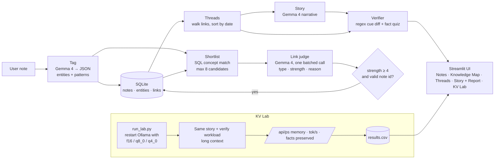

# newNectore

> A local-first second brain. Gemma 4 connects your scattered notes across subjects, narrates them as a story, **checks its own story against your notes for dropped facts**, and includes a lab that measures **how far Gemma's KV cache can be compressed before it starts forgetting things**.

Everything runs on a laptop through Ollama. No cloud API, and your notes never leave your machine.

## Team

**Team Name:** WInDaChat

| Member | Contribution |
| ------ | ------------ |
| Sahesh Karthikeyan | Database and infrastructure |
| Siva Krithick | Inference engine and quantization |
| V Aravindhan | Programmatic verification |
| Sathyanarayanan | Core logic, API, and synthesis |

## Problem Statement

### The Problem

Students and curious readers take notes in silos: Control Systems notes in one place, Computer Networks in another, news in a third. The most valuable insight is often the link between them. Negative feedback in a control loop, TCP congestion control and the RBI raising the repo rate to curb inflation are all the same idea: a feedback loop. Nobody sees that link, because the notes share almost no words.

AI summaries have a trust problem of their own. Published studies report that LLM summaries tend to drop caveats and overgeneralise ([Peters & Chin-Yee, *Royal Society Open Science*, 2025](https://pmc.ncbi.nlm.nih.gov/articles/PMC12042776)). An EBU/BBC study of AI assistants answering news questions found significant issues in 45% of answers ([AIB summary, 2025](https://aib.org.uk/ai-assistants-misrepresent-news-content-says-major-study/)). A fluent summary is not necessarily a faithful one.

Running models locally has a memory problem. Long prompts, such as "tell me the story of my last 30 notes", make the KV cache grow until it competes with the model weights for RAM and VRAM. KV-cache quantization (q8 / q4) saves memory, but community benchmarks report that Gemma 4 is unusually sensitive to it ([LocalBench](https://localbench.substack.com/p/kv-cache-quantization-benchmark)). "Just use q4" may quietly cost accuracy.

### Why We Chose This Problem

We are students. We wanted a tool we would use ourselves, one that turns a semester of disconnected notes into connected understanding. We also wanted it to be honest about its own output and able to run on the hardware students actually own. One open-weight model, Gemma 4, does all three jobs: it reasons about connections, audits its own summaries, and is the subject of our compression experiment.

## Solution

newNectore has three parts, all built on one local Gemma 4 model.

1. **Connect.** You write a note. Gemma 4 tags it with entities and abstract patterns (e.g. *feedback loop*, *trade-off*, *bottleneck*), shortlists related older notes, and judges each candidate. The result is a typed link (`causes`, `consequence_of`, `continuation`, `contradicts`, `same_idea`), a strength from 1 to 5, and a one-line reason citing a shared fact. Only strong links (>= 4) are kept. Linked notes form **threads**, and Gemma can narrate any thread as a short **story**.
2. **Verify.** Before you trust a story or a summary, a verification layer inspired by TrueSimple checks it against the source notes:
   - **Deterministic cue diff:** numbers, units, dates, negations (`not`, `never`), conditions (`unless`, `only if`) and bounds (`at least`, `up to`) are compared between source and output.
   - **Fact quiz:** Gemma extracts must-keep facts from the sources, then answers a question about each fact using *only* the generated text. A "not stated" answer means the fact may have been dropped.
   - Each fact is marked **Appears preserved**, **Needs review** or **Possible mismatch**, with the source span shown next to it.
3. **Compress (KV Lab).** The same story-plus-verify workload runs with Gemma's KV cache at `f16`, `q8_0` and `q4_0`. The lab records memory, speed and how many facts survive. The question it answers is how much memory can be saved before the model starts forgetting facts.

### Key Features

- One input box. No folders, tags or manual linking.
- Cross-subject links with a typed relation and a human-readable reason.
- An interactive knowledge map: each note is a node and each saved typed link is a labelled arrow.
- A thread view and an on-demand story mode.
- A faithfulness report on every story, with per-fact evidence and no blanket "verified" badge.
- KV Cache Lab: memory, story time and fact retention across KV-cache precisions, measured on real hardware.
- Fully local through Ollama, with structured JSON outputs validated by Pydantic.
## Innovation and Differentiation

- **Reasoned links instead of similarity scores.** Tools like Obsidian Smart Connections, Mem and Reflect surface "related notes" by embedding similarity. newNectore explains *why* two notes relate and *how* (cause, contradiction, same mechanism). It can find cross-domain links that share no vocabulary, because the tagging step extracts abstract patterns, not just keywords.
- **An AI that audits itself.** Most note apps hand you an AI summary and ask for trust. newNectore shows which facts from your notes survived in the summary and flags the ones that may not have.
- **One metric that ties it together.** We reuse the fact-preservation check as the quality metric for KV-cache compression. Instead of reporting only abstract numbers like KL divergence, the lab asks a user-level question: did compressing the cache make Gemma drop a fact from your notes?
- **Built for student hardware.** Gemma 4 E4B runs on a laptop. The KV Lab shows the memory/quality trade-off on the actual machine running the app.

## Technical Implementation

### Architecture



### Technology Stack

| Category        | Technologies |
| --------------- | ------------ |
| Frontend        | Streamlit |
| Backend         | Python 3.11+, Ollama HTTP API |
| Database        | SQLite |
| AI / ML         | Gemma 4 (`gemma4:e4b` by default, configurable) via Ollama; Pydantic for structured-output validation |
| Infrastructure  | Local machine (Ollama server) |
| APIs / Services | N/A, no external services |

### How It Works

**Note pipeline (two Gemma calls per note)**

1. **Tagging:** Gemma 4 returns `{summary, entities[], patterns[]}` against a JSON schema. Entity names are normalised (e.g. "Reserve Bank of India" → "RBI").
2. **Shortlisting:** a plain SQL query finds older notes that share an entity or pattern, capped at 8 candidates. No AI is used here, so it's fast and free.
3. **Linking:** one batched Gemma call judges all candidates and returns a list of `{note_id, type, strength, reason}`.
4. **Filtering:** a link is saved only if `strength ≥ 4`, the type is valid and `note_id` was in the shortlist, so the model cannot invent links. Zero links is a valid result.

**Threads** are not stored. They are computed by walking saved links and sorting by date. **Story** sends one thread to Gemma 4 and renders the returned narrative.

**Verifier**

- `verify/cues.py`: a regex extractor for numbers + units, dates, negations, conditions, bounds and obligation words. It diffs the counts between the sources and the generated text.
- `verify/quiz.py`: Gemma extracts must-keep facts from the source notes with source spans and a question for each. A second call answers each question from the generated text only, returning an answer or "not stated".
- Signals are combined per fact into *Appears preserved* / *Needs review* / *Possible mismatch*. There is no single overall score.

**KV Cache Lab**

- `lab/run_lab.py` restarts `ollama serve` with `OLLAMA_KV_CACHE_TYPE` set to `f16`, `q8_0` and `q4_0` in turn, with `OLLAMA_FLASH_ATTENTION=1`.
- For each setting it runs the largest connected thread in the local database with the selected context size.
- It records memory from `/api/ps`, story generation time, and the number of facts marked *Appears preserved*. Results go to `lab/results/results.csv`.
- The Streamlit **KV Lab** tab plots those results. All numbers shown come from runs on our machine.

### Technical Decisions

- **Ollama instead of a Hugging Face fake-quant pipeline.** Ollama applies real KV-cache quantization to the model we already serve, and finishes in hours rather than days. The trade-off is that Ollama sets K and V precision together. Separate K/V testing (K8/V4 vs K4/V8) needs `llama-server` with `--cache-type-k/--cache-type-v`, which is future work.
- **Two Gemma calls per note, not N+1.** Candidates are judged in one batched call, which keeps adding a note fast on a laptop.
- **Structured outputs are validated before persistence.** Ollama's JSON-schema `format` is used for tagging, linking, and fact checking; Pydantic rejects malformed output before it is stored. A failure is shown to the user rather than written to the database. The Ollama version used should be recorded under Setup before submission.
- **Strict linking.** A high threshold keeps the graph clean, so users don't wade through weak "both are about tech" links.
- **Evidence, not certification.** The verifier says "appears preserved", never "verified" or "safe". It can miss errors and raise false alarms, and the UI says so.
## Implementation During the Hackathon

The current repository implements the following local-first MVP pieces:

- [x] Note pipeline: schema-validated tagging, SQL concept shortlist, batched link judging, and strict link filtering
- [x] SQLite persistence for notes, concepts, and typed links
- [x] Connected-thread view and on-demand story generation
- [x] Faithfulness report with deterministic cue comparison and model-assisted fact questions
- [x] KV Cache Lab runner and CSV results view
- [x] Seed notes for a local demo

The KV Lab measures the current connected-note workload on the local machine; results must be generated before making performance or quality claims.

### Team Contributions

- **Sahesh Karthikeyan:** Database and infrastructure.
- **Siva Krithick:** Inference engine and quantization.
- **V Aravindhan:** Programmatic verification.
- **Sathyanarayanan:** Core logic, API, and narrative synthesis.

## Working Application

**Live Application:** Runs locally (requires Ollama + Gemma 4). See Setup.

## Demo Video

**Demo Video:** [Video URL]

## KV Cache Lab Results

_Filled in from `lab/results/results.csv` after running the lab. Nothing here is estimated._

| KV cache type | Context (tokens) | Memory (`/api/ps`) | Story time (s) | Facts preserved |
| ------------- | ---------------- | ------------------ | -------------- | --------------- |
| f16  | | | | |
| q8_0 | | | | |
| q4_0 | | | | |

**Hypothesis (from prior work, not yet our result):** KIVI and KVQuant found that keys contain outlier channels and are more sensitive to quantization than values, and LocalBench reports that Gemma 4 degrades more than other model families under KV quantization. We expect `q8_0` to keep most facts and `q4_0` to drop some at long context. Sample sizes are small, so we report raw counts and do not claim statistical significance.

## Open Source and AI Usage

### AI / Models

- **Gemma 4** (Google DeepMind, open weights, Apache 2.0): the only model in the app. It does four jobs:
  - tagging notes (entities and patterns)
  - judging and explaining links
  - narrating threads as stories
  - extracting facts and answering quiz questions for the verifier

  It is also the subject of the KV Cache Lab.

### Open Source Components

- **[Ollama](https://github.com/ollama/ollama)** (MIT): local model serving, structured outputs and KV-cache quantization.
- **[Streamlit](https://github.com/streamlit/streamlit)** (Apache 2.0): UI.
- **[Pydantic](https://github.com/pydantic/pydantic)** (MIT): schema validation of model outputs.
- **SQLite** (public domain): storage.
- **requests / httpx**: Ollama HTTP client.

### Ideas and research we build on

- QAGS-style question-answering faithfulness checks (Wang et al., 2020): the inspiration for the fact quiz.
- KIVI (arXiv:2402.02750) and KVQuant (arXiv:2401.18079): prior work on K vs V sensitivity in KV-cache quantization.
- LocalBench KV-cache quantization benchmark: a community report on Gemma 4's sensitivity.
## Setup and Usage

### Prerequisites

- Python 3.11+
- [Ollama](https://ollama.com) (tested with version: `[fill in: ollama --version]`)
- Gemma 4 pulled locally: `ollama pull gemma4:e4b`
- About 8 GB of free RAM/VRAM for E4B

### Installation

```bash
git clone https://github.com/chuckstone-cpu/hacktoberfest-hack-day-coimbatore-x-init-club-and-idea-club--Team_WInDaChat.git
cd hacktoberfest-hack-day-coimbatore-x-init-club-and-idea-club--Team_WInDaChat
python -m venv .venv && source .venv/bin/activate   # Windows: .venv\Scripts\activate
pip install -r requirements.txt
cp .env.example .env
```

### Environment Variables

```env
OLLAMA_HOST=http://localhost:11434
OLLAMA_MODEL=gemma4:e4b
NUM_CTX=16384
DB_PATH=data/nectore.db
```

### Running the Project

```bash
ollama serve                      # in one terminal
python -m scripts.seed            # optional: load demo notes
streamlit run app.py
```

Run the KV Cache Lab (this restarts the Ollama server three times):

```bash
python -m core.lab.run_lab --model gemma4:e4b --ctx 32768
```

### Usage

1. **Notes tab:** write a note and press Save. Tags and any new links appear immediately.
2. **Threads tab:** pick a thread and press **Tell the story**.
3. Under the story, open the **Faithfulness report** to see each fact from your notes and whether it survived.
4. **KV Lab tab:** view memory, speed and fact retention for f16 / q8_0 / q4_0 from your last lab run.

## Challenges and Learnings

_To be filled in after the event._

## Devpost Submission

**Devpost Project:** [Devpost Project URL]

## Credits and License

### Credits

Gemma 4 by Google DeepMind · Ollama · Streamlit · Pydantic · SQLite. Research credits are listed above.

### License

MIT. See `LICENSE`. Gemma 4 model weights are distributed under their own license (Apache 2.0).
