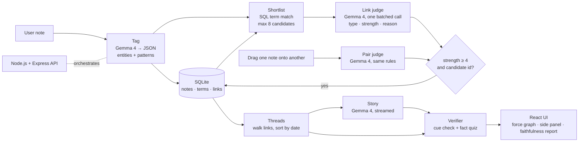

# Connectore

> A local-first second brain. Gemma 4 connects your scattered notes across subjects, narrates them as a story, and checks its own story against your notes for dropped facts.

Everything runs on a laptop through Ollama. There is no cloud API, and your notes never leave your machine.

## Team

**Team Name:** WInDaChat

| Member | Contribution |
| ------ | ------------ |
| V Aravindhan | Project lead; built the Node + React app, the Gemma pipeline, the verifier and the UI |
| Siva Krithick | Initial project scaffold, first README documentation, early knowledge-graph prototype |
| Sahesh Karthikeyan | Repository cleanup on `main` to make way for the final app |
| Sathyanarayanan | Python fact-verification prototype, frontend UI exploration |

## Problem Statement

### The Problem

Students and curious readers take notes in silos: Control Systems notes in one place, Computer Networks in another, news in a third. The most valuable insight is often the link between them. Negative feedback in a control loop, TCP congestion control and the RBI raising the repo rate to curb inflation are all the same idea: a feedback loop. Nobody sees that link, because the notes share almost no words.

AI summaries have a trust problem of their own. Published studies report that LLM summaries tend to drop caveats and overgeneralise ([Peters & Chin-Yee, *Royal Society Open Science*, 2025](https://pmc.ncbi.nlm.nih.gov/articles/PMC12042776)). An EBU/BBC study of AI assistants answering news questions found significant issues in 45% of answers ([AIB summary, 2025](https://aib.org.uk/ai-assistants-misrepresent-news-content-says-major-study/)). A fluent summary is not necessarily a faithful one.

### Why We Chose This Problem

We are students. We wanted a tool we would use ourselves, one that turns a semester of disconnected notes into connected understanding. We also wanted it to be honest about its own output and able to run on the hardware students actually own. One open-weight model, Gemma 4, does both jobs: it reasons about connections and audits its own summaries.

## Solution

Connectore has two parts, both built on one local Gemma 4 model.

1. **Connect.** You write a note. Gemma 4 tags it with entities and abstract patterns (e.g. *feedback loop*, *trade-off*, *bottleneck*), shortlists related older notes, and judges each candidate. The result is a typed link (`causes`, `consequence_of`, `continuation`, `contradicts`, `same_idea`), a strength from 1 to 5, and a one-line reason citing a shared fact. Only strong links (≥ 4) are kept. Linked notes form **threads**, and Gemma can narrate any thread as a short **story**. You can also drag one note onto another to ask Gemma whether they are connected.
2. **Verify.** Before you trust a story, a verification layer inspired by TrueSimple checks it against the source notes:
   - **Deterministic cue check:** numbers, units, dates, negations (`not`, `never`), conditions (`unless`, `only if`), limits (`at most`, `within`) and obligations (`must`, `may not`) are compared between the notes and the story.
   - **Fact quiz:** Gemma extracts must-keep facts from the notes, then answers a question about each fact using *only* the story. A "not stated" answer means the fact may have been dropped.
   - Each fact is marked **Appears preserved**, **Needs review** or **Possible mismatch**, with the source quote shown next to it.

### Key Features

- A single scrollable page in a warm "Paper & Ink" theme: Hero (with a carousel of your newest notes), Notes, Graph and Add sections, with a sticky nav.
- One input box. No folders, tags or manual linking.
- A searchable notes grid with deterministic coloured tags (the same tag is always the same colour; patterns are filled, entities outlined) and tag filters.
- A live knowledge graph: notes are glowing nodes, links are coloured by relation type, and new notes animate in and connect.
- Cross-subject links with a typed relation and a human-readable reason (hover a link to read it).
- Drag to connect: drop one note onto another and Gemma judges the pair, then draws the link or explains why they aren't related.
- A thread view and an on-demand, streamed story mode.
- A faithfulness report on every story, with per-fact evidence and no blanket "verified" badge.
- Fully local through Ollama, with structured JSON outputs validated by Zod.

## Innovation and Differentiation

- **Reasoned links instead of similarity scores.** Tools like Obsidian Smart Connections, Mem and Reflect surface "related notes" by embedding similarity. Connectore explains *why* two notes relate and *how* (cause, contradiction, same mechanism). It can find cross-domain links that share no vocabulary, because the tagging step extracts abstract patterns, not just keywords.
- **An AI that audits itself.** Most note apps hand you an AI summary and ask for trust. Connectore shows which facts from your notes survived in the story and flags the ones that may not have.
- **Strict by design.** A link needs strength 4/5 and a reason citing both notes, and a note with nothing in common (our photosynthesis seed note) correctly gets zero links.
- **Built for student hardware.** Gemma 4 E4B runs on a laptop.

## Technical Implementation

### Architecture



### Technology Stack

| Category        | Technologies |
| --------------- | ------------ |
| Frontend        | React 19 + Vite 8, Tailwind CSS 4, `react-force-graph-2d` (knowledge graph), `d3-force`, React Bits Carousel + Motion |
| Backend         | Node.js 22.13+ (developed on 24), Express 5, `ollama` JS client |
| Database        | SQLite via Node's built-in `node:sqlite` |
| AI / ML         | Gemma 4 (`gemma4:e4b` by default, configurable) served locally by Ollama; Zod for structured-output schemas and validation |
| Infrastructure  | Local machine only (Ollama server + Node API + Vite dev server) |
| APIs / Services | N/A, no external services |

### How It Works

**Note pipeline (two Gemma calls per note)** (`server/src/pipeline.js`)

1. **Tagging:** Gemma 4 returns `{summary, entities[], patterns[]}` against a JSON schema. Patterns reuse a small shared vocabulary ("feedback loop", "trade-off", …) so notes from different subjects can match, and vague patterns like "cause and effect" are forbidden.
2. **Shortlisting:** a plain SQL query finds up to 8 older notes that share an entity or pattern. No AI is used here, so it is fast and free.
3. **Linking:** one batched Gemma call judges all candidates and returns `{note_id, type, strength, reason}` for each.
4. **Filtering:** a link is saved only if `strength ≥ 4` and `note_id` was in the shortlist, so the model cannot invent links. Zero links is a valid result.

**Drag to connect** (`POST /api/connect`): one Gemma call judges just the dropped pair with the same rules. It returns both the strongest link (`reason`) and what separates the notes (`difference`). A link is saved as `origin='manual'` only if it reaches strength 4; otherwise the UI shows the difference.

**Threads** (`server/src/threads.js`) are not stored. They are computed by walking links in both directions (depth ≤ 3, ≤ 8 notes) and sorting by date. **Story** (`server/src/story.js`) sends one thread to Gemma 4 and streams the narrative as plain text.

**Verifier** (`server/src/verify/`)

- `cues.js`: a regex extractor (no AI) for numbers with units or currency, dates, negations, conditions, limits and obligation words. It reports cues from the notes that are missing or changed in the story. The condition words follow the team's earlier Python prototype.
- `quiz.js`: Gemma extracts up to 8 must-keep facts with exact source quotes (a fact whose quote isn't really in the notes is dropped), then a second call answers a question about each fact using only the story.
- Per fact: *Possible mismatch* if the story doesn't state it or loses a number from it; *Needs review* if answered but a cue such as "at most" is missing; otherwise *Appears preserved*. There is no single overall score.

**API**

| Method | Path | Does |
| ------ | ---- | ---- |
| GET | `/api/health` | model name and whether Ollama is up |
| GET | `/api/notes` | all notes with their terms |
| POST | `/api/notes` | `{text}` → runs the note pipeline → `{note, terms, links}` |
| GET | `/api/graph` | nodes and links for the graph |
| GET | `/api/thread/:id` | the ordered thread for a note |
| POST | `/api/story` | `{noteIds}` → streams the story |
| POST | `/api/verify` | `{noteIds, text}` → `{cues, facts}` |
| POST | `/api/connect` | `{a, b}` → Gemma judges the pair, saves the link if strong |

### Technical Decisions

- **Two Gemma calls per note, not N+1.** Candidates are judged in one batched call, which keeps adding a note to about 3–6 seconds on our laptop.
- **Structured outputs are always validated.** Every JSON call sends a Zod-derived JSON schema as Ollama's `format`, uses `think: false` and temperature 0, passes `num_ctx` explicitly (Ollama's default context can silently truncate prompts), validates the reply with Zod and retries once. A failure is shown to the user and never written to the database.
- **The note is always kept.** If Gemma is unavailable, the note is saved and shown as untagged instead of being lost.
- **Strict linking.** A high threshold keeps the graph clean, so users don't wade through weak "both are about tech" links.
- **Evidence, not certification.** The verifier says "appears preserved", never "verified" or "safe". It can miss errors and raise false alarms, and the UI says so.
- **Node instead of Python/Streamlit.** We wanted an interactive graph UI, so the app is a Node + React stack. Our earlier Python verification prototype (on the `main` branch) informed the cue check.

## Implementation During the Hackathon

Everything below was built during the Hack Day; the commit history on the `Aravind` branch records each step, and [`docs/HACKLOG.md`](docs/HACKLOG.md) has the details and measurements.

- **Skeleton app:** Node + Express API and React + Vite + Tailwind client as npm workspaces, with a live Ollama status pill.
- **Notes and graph:** SQLite storage, a note input, and notes shown as nodes in a force-directed graph.
- **Gemma tagging:** validated JSON tagging with summaries, entities and shared patterns.
- **Linking pipeline + seed data:** shortlist, batched link judging and strict filtering; `npm run seed` loads 10 demo notes through the real pipeline.
- **Graph interactions, threads and story:** link colours and legend, hover highlighting, a side panel with links and threads, and a streamed story.
- **Verifier:** cue check, fact quiz and a per-fact faithfulness report, with a sabotaged-story demo mode.
- **Drag to connect:** Gemma judges a user-proposed pair of notes.
- An earlier Python prototype of the cue check (spaCy + regex) was written by a teammate on the `main` branch; its condition-word list was ported into `server/src/verify/cues.js`.

What we measured on our laptop with the seed notes (from `docs/HACKLOG.md`):

- Tagging takes about 1.2–1.7 s per note once the model is loaded; adding a note (tag + link) takes about 3–6 s.
- Seeding the 10 demo notes saved 8–9 links across our runs (the model's scores vary slightly between runs): control systems, blood sugar, TCP, the RBI repo-rate note and supply/demand form one feedback-loop cluster, and the photosynthesis note correctly gets 0 links.
- The verifier flags the sabotaged library story with 3 *Possible mismatch* facts and 1 *Needs review*, while a real 6-note story had all 7 facts *Appears preserved*.

### Team Contributions

- **V Aravindhan:** Led the project and built the working app step by step: the Node + Express API and React client; notes stored in SQLite and shown as a live force graph; Gemma 4 tagging, shortlisting and batched linking with Zod-validated JSON; threads and the streamed story; the faithfulness verifier (cue check + fact quiz) with its demo mode; drag-to-connect; the fresh-clone install fix (switching to `node:sqlite`); the Paper & Ink UI revamp (scrollable home, coloured tags, React Bits carousel); the README and hack log; and merging everything into `main`.
- **Siva Krithick:** Scaffolded the initial project structure and configuration, wrote the first README project documentation, and built an early local knowledge-graph workspace prototype.
- **Sahesh Karthikeyan:** Cleaned up `main` by removing the obsolete Python prototype, data folders and old config, so the final Node app could be merged cleanly.
- **Sathyanarayanan:** Built the Python fact-verification prototype (spaCy fact extraction plus rule checks for numbers, negations and conditions), whose condition-word list was ported into the app's verifier, and explored an alternative frontend UI.

## Working Application

**Live Application:** Runs locally (it needs Ollama and Gemma 4 on the same machine). See [Setup and Usage](#setup-and-usage).

## Demo Video

**Demo Video:** in this google drive folder https://drive.google.com/drive/folders/1277CJ1Zk7lB6W79Xbb0EczfThwW4_cCk?usp=sharing
youtube link https://youtu.be/u50EQA64OMc?si=GsfJlZF0K0J9G1nl

## Open Source and AI Usage

### AI / Models

- **Gemma 4** (Google DeepMind, open weights, `gemma4:e4b` via Ollama): the only model in the app. It does five jobs:
  - tagging notes (summary, entities and patterns)
  - judging and explaining links, including drag-to-connect pairs
  - narrating threads as stories
  - extracting must-keep facts from notes for the verifier
  - answering the verifier's questions using only the story

  Gemma 4 model weights are distributed by Google under their own license terms.

### Open Source Components

- **[Ollama](https://github.com/ollama/ollama)** (MIT): local model serving with JSON-schema structured outputs.
- **[ollama-js](https://github.com/ollama/ollama-js)** (MIT): Ollama client for Node.
- **[Express](https://github.com/expressjs/express)** (MIT): API server. **[cors](https://github.com/expressjs/cors)** (MIT) and **[dotenv](https://github.com/motdotla/dotenv)** (BSD-2-Clause): CORS headers and `.env` loading.
- **SQLite** (public domain), through Node's built-in `node:sqlite` module: storage.
- **[Zod](https://github.com/colinhacks/zod)** (MIT): schemas for model outputs and request validation.
- **[React](https://github.com/facebook/react)** (MIT) + **[Vite](https://github.com/vitejs/vite)** (MIT) + **[Tailwind CSS](https://github.com/tailwindlabs/tailwindcss)** (MIT): frontend.
- **[react-force-graph](https://github.com/vasturiano/react-force-graph)** (MIT) and **[d3-force](https://github.com/d3/d3-force)** (ISC): the force-directed knowledge graph.
- **[React Bits](https://reactbits.dev) Carousel** by David Haz (MIT + Commons Clause): the carousel of recent notes in the hero. Installed with the shadcn CLI into `client/src/components/reactbits/Carousel/` and restyled for our theme; it is not our work. **[Motion](https://github.com/motiondivision/motion)** (MIT) powers its animation.
- **[concurrently](https://github.com/open-cli-tools/concurrently)** (MIT): runs the API and UI together in development.

### Ideas and research we build on

- QAGS-style question-answering faithfulness checks (Wang et al., 2020): the inspiration for the fact quiz.
- TrueSimple: our team's earlier idea for checking that simplified text keeps its facts, which became the verifier.
- Peters & Chin-Yee (2025) and the EBU/BBC study (2025), cited in the problem statement.

## Setup and Usage

### Prerequisites

- Node.js 22.13 or newer (developed on Node 24); the app uses Node's built-in SQLite, so no C++ build tools are needed
- [Ollama](https://ollama.com) (tested with version 0.40.1)
- Gemma 4 pulled locally: `ollama pull gemma4:e4b`

### Installation

```bash
git clone https://github.com/chuckstone-cpu/hacktoberfest-hack-day-coimbatore-x-init-club-and-idea-club--Team_WInDaChat.git
cd hacktoberfest-hack-day-coimbatore-x-init-club-and-idea-club--Team_WInDaChat
npm install              # installs the server + client workspaces
cp .env.example .env
```

### Environment Variables

```env
OLLAMA_HOST=http://localhost:11434   # Ollama server
OLLAMA_MODEL=gemma4:e4b              # model tag used for every call
NUM_CTX=16384                        # context window passed on every request
DB_PATH=nectore.db                   # SQLite file (created on first run)
PORT=3001                            # API port; the UI proxies /api here
```

No secrets or API keys are needed. `.env` is git-ignored.

### Running the Project

```bash
ollama serve         # if Ollama isn't already running
npm run seed         # optional: reset the database and load 10 demo notes
npm run dev          # API on :3001, UI on http://localhost:5173
```

`npm run seed` deletes everything in the database before loading the demo notes.

### Usage

1. **Write a note** in the Add section and press Save (or Ctrl/⌘ + Enter). Gemma's summary, tags and links appear under the box; "See it in the graph" jumps to it.
2. **Browse notes** in the Notes section: search, or click a tag to filter. Click a card, a carousel card or a graph node (click into the graph first to zoom and pan)
   to open the side panel: its summary, tags, links and thread. Its thread lights up in the graph.
3. Press **Tell the story** to stream a story that connects the thread.
4. Press **Check faithfulness** under the story to see each fact from your notes and whether it survived. On the library-rule demo note, tick **Use sabotaged story (demo)** to see the red flags.
5. **Drag one note onto another** to ask Gemma whether they are connected.

## Challenges and Learnings

- **Validating every model reply.** The very first Gemma call after the model loaded once returned no message at all. Every JSON call is now schema-constrained, validated with Zod and retried once, and a failure never reaches the database.
- **Cold starts.** The first call after Ollama loaded the model took about 32 s, so the API now warms the model up when it starts.
- **Getting patterns that actually connect subjects.** Gemma first tagged unrelated notes with vague patterns like "cause and effect", which would have linked everything to everything. A shared pattern vocabulary and an explicit ban on vague patterns fixed it.
- **Honest rejections.** When asked to reject a pair of notes, the model's one-line reason often argued *for* a similarity. Asking for two separate fields (what links them, and what separates them) gave clear explanations.
- **Faithfulness is subtle.** A story saying "a small fine" instead of "₹2 per day" reads fine but loses the fact. We made a number dropped from a fact count as a possible mismatch, not just a changed number.
- **Windows dev quirks.** `node --watch` restarted the API whenever Vite rewrote its cache; watching only `server/src` fixed it.
- **A clean install is the real test.** Our first install of `better-sqlite3` worked, but a fresh clone tried to compile it from source and failed without Visual Studio's C++ tools. We switched to Node's built-in `node:sqlite`, which needs nothing extra to install.

## Devpost Submission

**Devpost Project:** [Devpost Project URL]

## Credits and License

### Credits

Gemma 4 by Google DeepMind · Ollama · React · Vite · Tailwind CSS · react-force-graph · d3-force · Express · Zod · SQLite. Research credits are listed under [Ideas and research we build on](#ideas-and-research-we-build-on).

### License

MIT. See [LICENSE](LICENSE). Gemma 4 model weights are distributed under their own license.

## Submission Checklist

- [x] Project title and description added
- [x] All team members listed
- [x] Problem clearly explained
- [x] Reason for choosing the problem explained
- [x] Solution and key features documented
- [x] Innovation and differentiation explained
- [x] Architecture included
- [x] Technical implementation documented
- [x] Work completed during the hackathon documented
- [x] Team contributions documented
- [x] Working application is functional
- [ ] Live application link added where applicable (runs locally; no hosted version)
- [ ] Demo video added
- [x] AI and open-source components documented
- [x] Setup and usage instructions tested
- [x] Challenges and learnings documented
- [ ] Devpost submission completed
- [ ] Devpost link added
- [x] Credits added
- [x] License added
- [x] Repository is organized and complete
